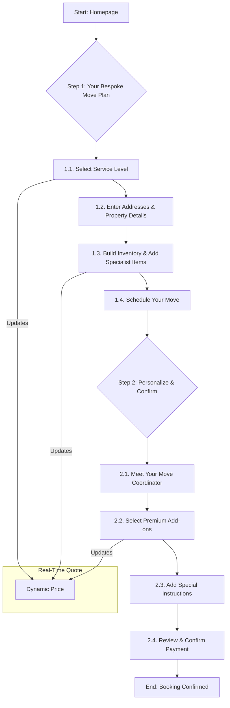

# Smart 2-Step Luxury Booking Workflow for Speedy Van

This document outlines a redesigned 2-step luxury booking workflow for Speedy Van, incorporating best practices from industry research and leveraging the existing project's strengths. The goal is to create a premium, intuitive, and efficient booking experience for high-value customers.

## Guiding Principles

*   **Premium Experience:** The workflow should feel exclusive, personalized, and seamless from start to finish.
*   **Clarity and Transparency:** Pricing, service options, and the booking process should be easy to understand.
*   **Trust and Confidence:** The user should feel confident that their belongings are in safe hands.
*   **Efficiency:** The booking process should be quick and easy to complete.

## The 2-Step Luxury Booking Workflow

### Step 1: The Quote - “Your Bespoke Move Plan”

This step focuses on gathering the essential details of the move while introducing the premium service options available.

**1.1. Service Level Selection:**

*   **Introduction:** The user is immediately presented with a choice of three service levels:
    *   **Signature:** Our standard high-quality service.
    *   **Premium:** Includes additional services like packing materials and a dedicated move coordinator.
    *   **White Glove:** A fully managed, all-inclusive moving experience.
*   **Visuals:** Each service level will be presented with a distinct icon and a brief, benefit-oriented description.

**1.2. Address & Property Details:**

*   **Premium Autocomplete:** Implement the `Luxury Booking Address Autocomplete Workflow` as specified in the project knowledge, using Google Places API as the primary source and Mapbox as a fallback for a fast and accurate address entry experience.
*   **Property Type:** Include visuals for property types (e.g., apartment, house, storage unit) to make the selection more intuitive.
*   **Access Details:** Add optional fields for access information (e.g., stairs, elevator, parking restrictions) to ensure a smooth moving day.

**1.3. Inventory & Specialist Items:**

*   **Smart Item Search:** Retain the existing smart search functionality, but with a more refined design.
*   **Specialist Items:** Introduce a dedicated section for high-value or delicate items (e.g., pianos, artwork, antiques). Selecting these items will trigger a notification that a specialist will be in touch to discuss handling requirements.
*   **Visual Inventory:** As users add items, a visual inventory with images and estimated volume will be displayed.

**1.4. Scheduling:**

*   **Date & Time:** Keep the user-friendly date and time selection, but with a more premium design.
*   **Flexibility:** Emphasize the ability to accommodate specific scheduling requests for premium and white-glove services.

**1.5. Real-Time Quote:**

*   **Dynamic Pricing:** A prominent, real-time quote will be displayed on the side of the screen, updating dynamically as the user makes selections.
*   **Price Breakdown:** The quote will provide a clear breakdown of costs, including the base price, service level add-ons, and any specialist item fees.

### Step 2: The Confirmation - “Personalize & Confirm”

This step focuses on personalizing the move and confirming the booking.

**2.1. Your Move Coordinator:**

*   **Introduction:** For premium and white-glove services, this section will introduce the user to their dedicated move coordinator, including a photo and a brief bio.
*   **Direct Contact:** The coordinator's direct contact information will be provided, emphasizing a personalized and high-touch service.

**2.2. Premium Add-ons:**

*   **Service Enhancements:** Offer a selection of premium add-ons, such as:
    *   Professional packing and unpacking services.
    *   Furniture disassembly and reassembly.
    *   Short-term and long-term storage solutions.
    *   Post-move cleaning services.
*   **Visual Selection:** Each add-on will be presented with a clear description and pricing.

**2.3. Special Instructions:**

*   **Personalized Requests:** A dedicated text area for users to add any special instructions or requests, reinforcing the bespoke nature of the service.

**2.4. Confirmation & Payment:**

*   **Booking Summary:** A comprehensive summary of the move plan, including all selected services, items, and costs.
*   **Secure Payment:** A seamless and secure payment process using Stripe, with clear labeling and no hidden fees.
*   **Confirmation:** Upon successful payment, the user will receive an immediate on-screen confirmation, followed by a detailed confirmation email from their move coordinator.

## Workflow Diagram

