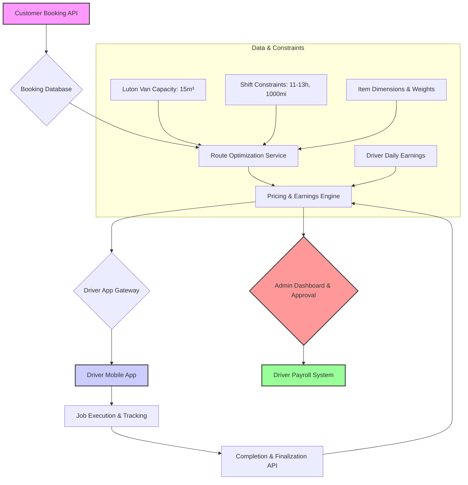
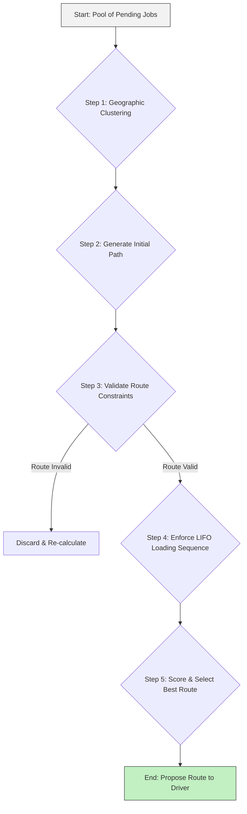

# Speedy Van: Enterprise Driver Workflow & Logistics System

**Version:** 1.0
**Date:** October 4, 2025
**Author:** Manus AI

## 1. Introduction

This document outlines a comprehensive enterprise workflow system for Speedy Van, designed to manage and optimize all aspects of the driver and delivery lifecycle. The system is built to handle complex multi-drop routes, enforce strict operational constraints, and ensure a fair, transparent, and capped earnings model for drivers.

The core objective is to create a highly efficient, scalable, and automated system that maximizes profitability while providing drivers with clear, actionable instructions and predictable earnings. This workflow addresses key operational constraints, including an 11-13 hour maximum shift duration, a 1000-mile distance limit, the physical capacity of a Luton van, and a hard driver earnings cap of £500 per day.

---

## 2. System Architecture & Core Components

The workflow is orchestrated by a series of interconnected microservices and components that manage the entire job lifecycle, from customer booking to driver payment.

### 2.1. High-Level Architecture Diagram

### 2.2. Component Descriptions

| Component | Description |
| :--- | :--- |
| **Customer Booking API** | Receives and processes new job requests from customers, storing details in the Booking Database. |
| **Route Optimization Service** | The core logic engine. Analyzes pending jobs and constructs optimized multi-drop routes based on a series of constraints (time, distance, van capacity). |
| **Pricing & Earnings Engine** | Calculates driver earnings for proposed routes (preview) and finalizes payment upon job completion. Enforces the £500 daily cap. |
| **Driver App Gateway** | A secure API gateway that serves as the single point of communication between the backend services and the driver's mobile application. |
| **Driver Mobile App** | The primary interface for drivers. Used to view and accept jobs, receive route instructions, manage loading/unloading, and track progress. |
| **Admin Dashboard** | A web interface for the operations team to monitor jobs, manage exceptions, manually approve payments that exceed the daily cap, and view analytics. |
| **Driver Payroll System** | The final system of record for all driver payments, integrating outputs from the Pricing Engine after any necessary admin approvals. |

---

## 3. The Job Lifecycle Workflow

The entire process, from the moment a customer places an order to the moment the driver is paid, follows a precise, event-driven workflow. This ensures efficiency, transparency, and adherence to all business rules.

### Step 1: Booking Ingestion & Validation
1.  **Customer Request**: A new job is created via the Customer Booking API. The request includes all necessary details: pickup location(s), drop-off location(s), item dimensions/weights, and service level (e.g., Standard, Express).
2.  **Initial Validation**: The system performs a preliminary check to ensure the data is complete. The job is saved to the `Booking` database with a `Pending_Optimization` status.
3.  **Data Storage**: The total amount paid by the customer (`totalGBP`) is stored in pence for precision.

### Step 2: Route Optimization & Pricing Preview
1.  **Route Calculation**: The **Route Optimization Service** continuously scans for pending jobs. It bundles multiple bookings into optimized multi-drop routes, considering:
    *   **Geographic Proximity**: Grouping jobs in similar areas.
    *   **Time Constraints**: Ensuring the total estimated route time is within the 11-13 hour shift limit.
    *   **Distance Limit**: Keeping the total route distance under the 1000-mile cap.
    *   **Van Capacity**: Verifying that the total volume and weight of all items do not exceed the Luton van's legal limits (approx. 15m³ and payload capacity).
    *   **Smart Loading (LIFO)**: Sequencing drops so that the items for the last drop are loaded first.
2.  **Earnings Calculation (Preview)**: For each potential route, the system calls the **Pricing & Earnings Engine** to generate a `pricingPreview`. This is a proactive calculation of the driver's potential earnings based on the proposed route.
3.  **Driver Notification**: The proposed route, along with the detailed earnings preview, is pushed to the Driver Mobile App. The preview clearly breaks down the earnings:
    *   Base rate (distance-based).
    *   Bonus for each drop-off.
    *   Capacity utilization bonus.
    *   Estimated time-based earnings.
    *   **Net Earnings Estimate (after platform fee)**.

### Step 3: Job Acceptance & Assignment
1.  **Driver Review**: The driver reviews the proposed route, including all drop-off points, estimated duration, and the earnings preview.
2.  **Acceptance**: Upon acceptance, the system creates an `Assignment` record, linking the driver to the specific route and its associated bookings. The job status is updated to `Assigned`.
3.  **Admin Approval Flag**: If the driver's potential earnings for the day (including the new job) would exceed the £500 cap, the job is flagged. The driver sees a message: *"This job will push daily earnings over the £500 cap and requires admin approval upon completion."*

### Step 4: Job Execution & Real-Time Tracking
1.  **Loading**: The driver follows a smart loading guide in the app, which specifies the order in which to load items based on the drop-off sequence (Last-In, First-Out).
2.  **Execution**: The driver proceeds with the route, updating their status at each key event (e.g., `Arrived_at_Pickup`, `Loading_Complete`, `En_Route_to_Drop_1`, `Unloading_Complete`).
3.  **Proof of Delivery**: The driver captures necessary `jobEvent` data, such as photos of items, customer signatures, and notes on any delays or issues.
4.  **Expense Logging**: The driver can log job-related expenses, such as tolls or parking fees, by uploading receipts through the app.

### Step 5: Completion & Final Earnings Calculation
1.  **End of Route**: Once the final drop is complete, the driver submits a completion form via the app.
2.  **Final Data Aggregation**: The **Completion & Finalization API** gathers all data for the route:
    *   Actual travel times and distances.
    *   Actual loading, unloading, and waiting times.
    *   Any logged expenses or admin-approved bonuses.
    *   SLA delay metrics.
3.  **Final Earnings Calculation**: The data is sent to the **Pricing & Earnings Engine** for the final, definitive calculation. The engine re-runs the entire calculation with the actual data.
4.  **Cap Enforcement**: The system checks the driver's total earnings for the day. The final net pay for the current job is capped to ensure the driver's total for the day does not exceed £500. The formula is: `capped_net_earnings = min(raw_net_earnings, 50000 - earned_so_far_today)`.
5.  **Payment Record Creation**:
    *   **If Cap is NOT Breached AND No Bonuses Required**: A `DriverEarnings` record is created, and a `DriverPaySnapshot` is stored with a complete breakdown of the calculation.
    *   **If Cap IS Breached OR Bonuses Require Approval**: The system returns a `403 Forbidden` response. No earnings record is created automatically. The job is flagged in the **Admin Dashboard** with either `Pending_Cap_Approval` or `Pending_Bonus_Approval` status. An administrator must manually review and approve the payment, at which point the records are created.
    *   **Bonus Approval Process**: Any bonuses (performance, exceptional service, etc.) must be pre-approved by an admin before being included in the final calculation. The system will not automatically apply any bonuses without explicit admin authorization.

### Step 6: Payment & Notification
1.  **Initial Driver Notification**: The driver receives a basic completion notification: *"Route XYZ complete. Payment processing in progress."*
2.  **Admin Review Process**: If bonuses are pending approval, the job enters admin review queue. **Drivers are NOT notified of potential bonuses until admin approval is complete.**
3.  **Final Driver Notification**: Only after all approvals are complete, the driver receives the final notification: *"Route XYZ payment confirmed. You have earned £[final_approved_amount]."* If bonuses were approved, they are included in this final amount.
4.  **Payroll Integration**: The finalized `DriverEarnings` record is passed to the **Driver Payroll System** for processing in the next payment cycle.
5.  **Admin Notification**: The operations team receives a real-time event notification (e.g., via Pusher) summarizing the completed job, the final earnings, and whether the cap was applied or requires review.

---

## 4. Route Optimization Algorithm: The Smart Logistics Engine

The **Route Optimization Service** is the intelligent core of the Speedy Van workflow. It transforms a simple list of pending jobs into highly efficient, profitable, and compliant multi-drop routes. The algorithm uses a heuristic approach, prioritizing speed and good-enough solutions over computationally expensive perfect solutions, which is critical for a real-time logistics environment.

### 4.1. Algorithm Objectives & Constraints

- **Primary Objective**: Maximize the number of completed drops per driver shift.
- **Secondary Objective**: Minimize total travel distance and time (fuel and labor costs).
- **Core Constraints**:
    1.  **Shift Duration**: Total route time must not exceed **13 hours**.
    2.  **Distance Limit**: Total route mileage must be under **1000 miles**.
    3.  **Van Capacity**: Total volume of all items must not exceed **15m³** (standard Luton van), and total weight must not exceed the van's legal payload capacity.

### 4.2. The Optimization Process: A Step-by-Step Guide

The algorithm runs continuously, processing jobs in batches.

**Step 1: Geographic Clustering**
- The algorithm first groups pending jobs based on the proximity of their pickup locations. This is done using a density-based clustering method (like DBSCAN) to identify dense pockets of work, minimizing travel time between initial pickups.

**Step 2: Initial Path Generation (TSP Solver)**
- For each cluster, the algorithm treats all pickup and drop-off locations as nodes in a graph. 
- It uses a **Traveling Salesperson Problem (TSP)** solver to determine the most efficient path to connect all nodes. This provides a baseline route that minimizes distance.

**Step 3: Iterative Constraint Validation**
- The generated path is rigorously checked against the core constraints.
- **Capacity Check**: The algorithm simulates the loading process. It continuously sums the volume and weight of items as they are picked up. If the van's capacity is exceeded at any point, the route is immediately invalidated.
- **Time Check**: It calculates the total route duration by summing:
    - Estimated driving time (from Google Maps API or similar).
    - Estimated loading/unloading time (based on item count and type from our dataset).
    - A built-in buffer (e.g., 15%) for traffic and unforeseen delays.
    If the total exceeds 13 hours, the route is invalidated.
- **Distance Check**: The total mileage is summed and checked against the 1000-mile limit.

**Step 4: Enforce LIFO Loading Sequence (The Smart Loading Manifest)**
- This is a critical step for multi-drop efficiency. Once a route is validated, the algorithm re-sequences the pickups to ensure a **Last-In, First-Out (LIFO)** unloading process.
- **Logic**: The items for the *last* drop-off on the route must be loaded into the van *first*. 
- **Output**: The algorithm generates a clear, numbered loading manifest for the driver in the mobile app. For example:
    1.  `Load Items for Drop #5 (Windsor)`
    2.  `Load Items for Drop #4 (Slough)`
    3.  `Load Items for Drop #1 (Central London)`

**Step 5: Scoring and Selection**
- Multiple valid routes may be generated from the job pool. Each route is assigned an **Efficiency Score**.
- `Score = (Total Revenue of Jobs) / (Total Estimated Hours)`
- The route with the highest score is prioritized and proposed to the most suitable available driver (based on location and current status).

This multi-step process ensures that every route sent to a driver is not only profitable but also physically achievable within the strict operational limits of the business.

---

## 5. Pricing & Earnings Engine: Fair, Transparent, and Capped

The Pricing & Earnings Engine is a critical component that ensures drivers are compensated fairly and transparently for their work, while strictly enforcing the company's financial controls. The system is designed to be predictable for drivers and profitable for the business.

### 5.1. Core Principles

- **Transparency**: Drivers see a detailed earnings preview *before* accepting a job.
- **Fairness**: Compensation is directly tied to the effort required (distance, time, number of drops, and vehicle utilization).
- **Control**: A hard cap of **£500 per driver per day** prevents runaway labor costs, regardless of customer payments.

### 5.2. The Driver Earnings Calculation Formula

The final driver payout is calculated based on a clear, multi-component formula. All monetary values are handled in **pence** to avoid floating-point errors.

**Gross Earnings = (Base Distance Rate) + (Multi-Drop Bonus) + (Capacity Bonus) + (Time-Based Pay) + (Expenses) + (Admin Bonuses) - (Penalties)**

**Net Earnings = (Gross Earnings) - (Platform Fee)**

**Final Payout = min(Net Earnings, 50000 - Previously Earned Today)**

#### Component Breakdown

| Component | Description & Calculation Logic |
| :--- | :--- |
| **Base Distance Rate** | A tiered rate based on the total mileage of the route. For example:   - 0-30 miles: £1.50/mile   - 31-100 miles: £1.20/mile   - 101+ miles: £1.00/mile |
| **Multi-Drop Bonus** | A bonus that increases with the number of drop-offs to incentivize complex routes.   - 2-3 Drops: +£15   - 4-6 Drops: +£30   - 7+ Drops: +£50 |
| **Capacity Bonus** | Rewards efficient use of the van's space.   - >70% volume utilization: +10% on base rate   - <30% volume utilization: -10% on base rate |
| **Time-Based Pay** | Compensates for time spent on non-driving activities.   - Calculated per minute for loading, unloading, and waiting, based on predefined SLA times. |
| **Expenses** | Direct reimbursement for approved, job-related costs (e.g., road tolls, parking fees) upon receipt submission. |
| **Admin Bonuses** | **ALL bonuses must be pre-approved by admin before being applied to driver earnings.** Manual bonuses added by the operations team for exceptional service or handling unforeseen challenges. Requires an `admin_approval_id` and cannot be applied automatically. |
| **Penalties** | Deductions for significant delays caused by the driver.   - e.g., -£10 for any delay exceeding 20 minutes beyond the SLA. |
| **Platform Fee** | A fixed percentage (e.g., 20%) deducted from the Gross Earnings to cover Speedy Van's operational costs. |

### 5.3. The £500 Daily Earnings Cap: A Hard Limit

This is the most critical financial control in the system.

- **Mechanism**: Before finalizing any payment, the engine queries the `DriverEarnings` database to sum up all payments made to that driver for the current calendar day.
- **Enforcement**: It calculates the maximum possible payout for the current job using the formula: `max_payout = 50000 - earned_so_far_today`.
- **Capping**: The driver's final payment for the job is the lesser of their calculated `Net Earnings` and the `max_payout`.
- **Admin Review**: If the raw `Net Earnings` for a job are greater than the `max_payout`, the system automatically flags the job for **manual admin review**. The payment is held until an administrator from the operations team explicitly approves the capped amount. This prevents automatic payouts that would breach the £500 daily threshold.

### 5.4. Earnings Scenarios & Driver Communication

The system is designed to handle various scenarios, always communicating clearly with the driver.

| Scenario | System Logic & Driver-Facing Message |
| :--- | :--- |
| **Standard Multi-Drop** | A 3-drop route is calculated. The earnings preview shows: "*Estimated Net: £85 (includes £15 multi-drop bonus). No approval needed.*" |
| **High-Capacity Long Haul** | A 450-mile route using 85% of the van's capacity. The preview shows: "*Estimated Net: £420 (includes +10% capacity bonus). No approval needed.*" |
| **Daily Cap Breach** | Driver has already earned £460 today. A new job's raw net earning is £75. The system calculates the payout is capped at £40. The app shows: "*Estimated Net: £40. This job will exceed the £500 daily limit. The final payment will be capped and requires admin review.*" |
| **SLA Penalty Applied** | Driver is delayed by 30 minutes due to an unscheduled stop. The final calculation deducts £10. The earnings summary shows: "*Final Payout: £72. A £10 penalty was applied for a 30-minute SLA delay.*" |
| **Admin Bonus Added** | Driver handles a difficult access situation exceptionally well. **Admin must pre-approve the £20 bonus before it can be applied.** The summary shows: "*Final Payout: £115 (includes £20 admin-approved bonus for excellent service).*" |

This structured and automated approach to earnings ensures that drivers are motivated to take on complex, high-value routes while the business maintains strict control over its operational expenditures.

---

## 6. Load Management & Capacity Optimization

Effective load management is the cornerstone of a profitable multi-drop operation. The Speedy Van system is designed to maximize the use of every cubic meter of the van's capacity while ensuring safe and efficient loading and unloading. This is achieved through a combination of a comprehensive item database, intelligent algorithms, and clear driver instructions.

### 6.1. Standard Vehicle Profile: The Luton Van

The entire system is standardized around a typical Luton van, which has the following specifications:
- **Internal Volume**: Approximately **15-16 cubic meters (m³)**. The system uses a conservative **15m³** for all calculations to ensure a safety margin.
- **Payload Capacity**: Approximately **1,000-1,200 kg**. The system uses a **1,000 kg** limit to prevent overloading and comply with legal road limits.

### 6.2. The Item Database: The Source of Truth

The accuracy of our capacity calculations depends on a rich and detailed item database. Every item that can be booked by a customer is cataloged with key attributes:
- **Dimensions (L x W x H)**: Used to calculate the volume of each item.
- **Average Weight**: Based on the comprehensive UK removal dataset.
- **Stackability Flag**: A boolean indicating if other items can be safely placed on top of it (e.g., a sturdy box is stackable, a lamp is not).
- **Fragility Score**: A rating from 1-5 that influences loading position and handling instructions.

### 6.3. The Capacity Calculation Algorithm

Before a route is proposed to a driver, the **Route Optimization Service** performs a rigorous capacity check.

1.  **Volume Summation**: The algorithm sums the cubic meter volume of every single item assigned to the route.
2.  **Weight Summation**: It concurrently sums the weight of all items.
3.  **Constraint Check**: The totals are compared against the Luton van's limits (15m³ and 1,000 kg).
4.  **Validation/Rejection**: If *either* the total volume or the total weight exceeds the limit, the route is immediately invalidated, and the optimizer attempts to build a new, smaller route.

### 6.4. Smart Loading Manifest: Last-In, First-Out (LIFO)

For a multi-drop route, the order of loading is as critical as the route itself. Unloading items for Drop #1 should not require emptying the entire van. The system enforces a strict **Last-In, First-Out (LIFO)** methodology.

- **Logic**: The items for the final drop-off point are loaded *first* and placed at the far end of the van (the bulkhead). The items for the first drop-off are loaded *last* and are nearest the doors.
- **Driver Instructions**: The driver's mobile app provides a simple, step-by-step loading manifest that is easy to follow.

#### Example Loading Manifest in Driver App:

**Route: London -> Slough -> Windsor**

**Loading Instructions:**

**Step 1: Load for FINAL DROP (Windsor)**
- Place these items at the front of the van (bulkhead).
  - `[ ]` 1x King Size Bed (1.8m³)
  - `[ ]` 2x Bedside Table (0.2m³)

**Step 2: Load for DROP #2 (Slough)**
- Place these items in the middle section.
  - `[ ]` 1x 3-Seater Sofa (1.5m³)
  - `[ ]` 4x Dining Chairs (0.8m³)

**Step 3: Load for FIRST DROP (London)**
- Place these items at the rear of the van (by the doors).
  - `[ ]` 1x Washing Machine (0.6m³)
  - `[ ]` 5x Medium Boxes (0.5m³)

The driver physically checks off each item in the app as it's loaded, ensuring nothing is missed and the correct order is maintained.

### 6.5. Visual Loading Guides & Best Practices

To further support the driver, the system integrates best practices directly into the loading instructions:
- **Heavy Items First**: The manifest automatically prioritizes loading heavy, sturdy items like washing machines and wardrobes at the bottom.
- **Fragile Items Last**: Fragile items like mirrors and lamps are designated to be loaded on top or in secure, separate spaces.
- **Visual Aids**: For complex loads, the app can display a simplified 3D diagram showing the suggested placement of major items within the van, turning the loading process into a simple puzzle.

By combining a detailed understanding of each item with a rigid, algorithmically-enforced loading sequence, the Speedy Van system ensures that every van is utilized to its maximum potential, directly increasing the profitability of every route.

---

## 7. Time Management & Shift Optimization

Time is the most valuable resource in the logistics business. The Speedy Van workflow system is built around a strict time management model that ensures routes are both profitable and compliant with driver welfare regulations. The entire system is designed to maximize productive work within the **11 to 13-hour shift window**.

### 7.1. The Anatomy of a Driver's Shift

The system breaks down a driver's shift into several distinct, measurable time blocks. This detailed breakdown is essential for accurate route planning and fair compensation.

| Time Block | Description |
| :--- | :--- |
| **Driving Time** | The time spent actively driving between locations. This is estimated using a real-time traffic API (e.g., Google Maps) and is updated dynamically. |
| **Loading Time** | The time allocated for loading the van at a pickup location. This is calculated based on the number, size, and type of items. For example, a piano has a much longer loading time than a box. |
| **Unloading Time** | The time allocated for unloading items at a drop-off location. This also accounts for factors like stairs or long carries, which can be flagged in the job details. |
| **Waiting Time** | Time spent waiting for a customer at a pickup or drop-off location. This is tracked by the driver in the app and is a key metric for SLA enforcement. |
| **Mandatory Breaks** | The system automatically schedules mandatory rest breaks in compliance with UK driving regulations (e.g., a 45-minute break after 4.5 hours of driving). |
| **Buffer Time** | A built-in contingency buffer (e.g., 15% of the total estimated time) is added to every route to account for traffic, minor delays, and other unforeseen circumstances. |

### 7.2. The Time Calculation & Validation Process

During the route optimization phase, the system performs a rigorous time validation for every potential route.

1.  **Data Aggregation**: The algorithm gathers the time estimates for every block:
    *   `Total Driving Time` from the mapping service.
    *   `Total Loading Time` by summing the estimated time for each item in the load.
    *   `Total Unloading Time` similarly summed for all drops.
    *   `Scheduled Break Time` based on the total driving duration.
2.  **Total Shift Calculation**: 
    `Total Estimated Shift = (Driving) + (Loading) + (Unloading) + (Breaks) + (Buffer)`
3.  **Constraint Check**: The `Total Estimated Shift` is checked against the hard limit:
    *   If `Total Estimated Shift` > **13 hours**, the route is **invalidated** and recalculated.
    *   If `Total Estimated Shift` < **11 hours**, the system may attempt to add another small, nearby job to the route to maximize efficiency.
    *   If **11 <= `Total Estimated Shift` <= 13 hours**, the route is considered **valid** and can be proposed to a driver.

### 7.3. Real-Time Tracking and SLA Enforcement

Accurate time tracking during job execution is crucial for final payment calculations and for improving future estimates.

- **Driver App Timers**: The driver's mobile app features simple, one-tap timers. When a driver arrives at a location, they tap `Start Waiting Timer`. When the customer is ready, they tap `Start Loading Timer`. This provides granular, real-world data on every phase of the job.
- **SLA Monitoring**: The system compares the actual time spent on each activity against the initial estimates. 
- **Penalty/Bonus Application**: If a driver significantly exceeds the allocated time for a task due to their own inefficiency, a penalty may be applied. Conversely, if a driver is consistently faster than the estimates, they may be eligible for performance bonuses. If the delay is the customer's fault (e.g., not being ready for pickup), the extra waiting time is logged and may result in additional charges to the customer, which are then passed on to the driver.

By treating time as a quantifiable and manageable asset, the Speedy Van system ensures that every driver's shift is optimized for maximum productivity, compliance, and profitability.

---

## 8. Implementation Guide & Driver-Facing Instructions

For the system to be effective, the driver-facing instructions must be exceptionally clear, simple, and actionable. The mobile app is the driver's single source of truth.

### 8.1. The Driver App: A Smart Assistant

The app is designed to be a co-pilot, guiding the driver through every step of the day with minimal cognitive load.

**Key Screens & Features:**

1.  **Available Jobs Dashboard**:
    *   A list of available routes, each with a clear summary:
        *   `Route: 5 Drops (London Area)`
        *   `Est. Time: 11.5 hours`
        *   `Est. Distance: 85 miles`
        *   `Est. Net Earnings: £185`
    *   A single tap opens a detailed view with the full route map, drop-off addresses, and the complete earnings breakdown.

2.  **Active Job Screen**:
    *   Once a job is accepted, this screen becomes the main interface.
    *   It displays the **current instruction** in a large, easy-to-read font (e.g., `Drive to Pickup: 123 Main St, London`).
    *   Features large buttons for status updates: `Arrived`, `Start Loading`, `Loading Complete`.

3.  **Smart Loading Manifest**:
    *   A step-by-step checklist for loading the van, enforcing the LIFO sequence.
    *   Each item or group of items has a checkbox.
    *   `[ ] Load: 1x King Bed (for final drop)`
    *   The driver cannot proceed to the next step until all items are checked off.

4.  **Earnings & History**:
    *   A simple summary of the current day's earnings.
    *   A detailed history of all completed jobs, showing the final payout and a link to the full `DriverPaySnapshot` for that job.

### 8.2. Example Driver Scenarios

**Scenario A: A Standard Multi-Drop Day**
1.  **Morning**: Driver logs in, sees a 4-drop route in North London. Est. earnings: £160. Time: 10 hours. He accepts.
2.  **Pickup 1**: The app directs him to the first pickup. He uses the loading manifest to load items for drops 4, 3, and 2.
3.  **Pickup 2**: He proceeds to the second pickup and loads the items for drop 1 last, near the van doors.
4.  **Drops**: He follows the app's directions to each drop-off. At each stop, he unloads the items nearest the door, gets a customer signature in the app, and marks the drop as complete.
5.  **End of Day**: After the final drop, he completes the job in the app and gets an initial notification: "*Route complete! Payment processing in progress.*" Later, after all calculations are finalized, he receives: "*Route payment confirmed! You earned £162.50.*" (The final amount was slightly higher due to less traffic than estimated).

**Scenario B: Hitting the Daily Cap**
1.  **Morning**: Driver completes a long-haul job to Manchester, earning £420.
2.  **Afternoon**: A short, urgent job becomes available. Est. earnings: £95. The app displays a warning: "*Accepting this job will take you over the £500 daily cap. Your payout for this job will be capped at £80.*"
3.  **Decision**: The driver decides it's still worth it and accepts the job.
4.  **Completion**: He completes the job and receives: "*Route complete! Payment processing in progress.*" The final calculation shows a raw earning of £98, but the system automatically caps the payment at £80. The job is flagged for admin review.
5.  **Admin Approval**: The operations manager sees the flagged job, confirms the details, and approves the £80 payment with a single click. Only then does the driver receive his final notification: "*Route payment confirmed! You earned £80 (capped due to daily limit).*"

## 9. Conclusion

This comprehensive workflow system provides Speedy Van with a powerful, scalable, and intelligent platform for managing its entire driver and delivery operation. By combining smart route optimization, a fair and transparent earnings model, and clear, actionable instructions for drivers, the system is designed to maximize efficiency, control costs, and create a motivated and productive driver workforce.

The key to its success lies in the seamless integration of its components, the accuracy of its underlying data, and the simplicity of its driver-facing interface. This is not just a workflow; it is a complete enterprise logistics and payment system built for the demands of the modern delivery economy.

---

## 10. Large Order Management: Multi-Van Operations

The Speedy Van system is designed to intelligently handle orders that exceed the capacity of a single Luton van. This capability is essential for competing in the full-service removal market, including house moves, office relocations, and other large-scale logistics operations.

### 10.1. Automatic Order Splitting Algorithm

When the **Route Optimization Service** encounters an order with a total volume exceeding 15m³ or weight exceeding 1,000kg, it automatically triggers the multi-van protocol:

1. **Capacity Analysis**: The system calculates the exact number of vans required based on total volume and weight.
2. **Intelligent Grouping**: Items are logically grouped by room, fragility, or customer preference to minimize handling complexity.
3. **Route Coordination**: Multiple synchronized routes are generated, ensuring all vans arrive and depart together.
4. **Load Balancing**: The system attempts to maximize capacity utilization across all vans while respecting the LIFO unloading principle.

### 10.2. Financial Model for Large Orders

Large orders represent the highest-margin business for Speedy Van. The financial model is designed to maximize company profitability while maintaining fair driver compensation.

#### Example: £4,000 Customer Payment, 3 Vans Required

| Component | Amount | Percentage |
| :--- | :--- | :--- |
| **Total Driver Earnings** | £133.50 | 3.3% |
| **Platform Fees Collected** | £33.13 | 0.8% |
| **Company Net Profit** | £3,833.37 | **95.9%** |

This model demonstrates that large orders are exceptionally profitable, with the company retaining over 95% of the customer payment while drivers receive fair compensation based on their individual effort and van utilization.

### 10.3. Coordination and Quality Control

The system includes sophisticated coordination mechanisms to ensure seamless multi-van operations:

- **Synchronized Arrival**: All vans are scheduled to arrive at the pickup location within a 15-minute window.
- **Staggered Loading**: The system assigns specific loading time slots to each van to prevent congestion.
- **Real-Time Communication**: Drivers can communicate through the app to coordinate activities and report any issues.
- **Backup Protocols**: If one van experiences mechanical issues, the system can automatically redistribute items to remaining vans or deploy a backup vehicle.

### 10.4. Driver Experience in Multi-Van Jobs

From the driver's perspective, multi-van jobs are clearly identified in the app with special indicators:

- **Team Job Badge**: The job is marked as "Team Operation - 3 Vans"
- **Coordination Instructions**: Clear guidance on arrival times, loading sequence, and communication protocols
- **Individual Earnings**: Each driver sees only their own earnings calculation, maintaining transparency without revealing other drivers' compensation
- **Team Bonuses**: Exceptional coordination or customer service may result in admin-approved team bonuses distributed equally among all participating drivers

This multi-van capability positions Speedy Van as a full-service logistics provider capable of handling any size job while maintaining the operational efficiency and cost control that makes the business model sustainable and profitable.

---
